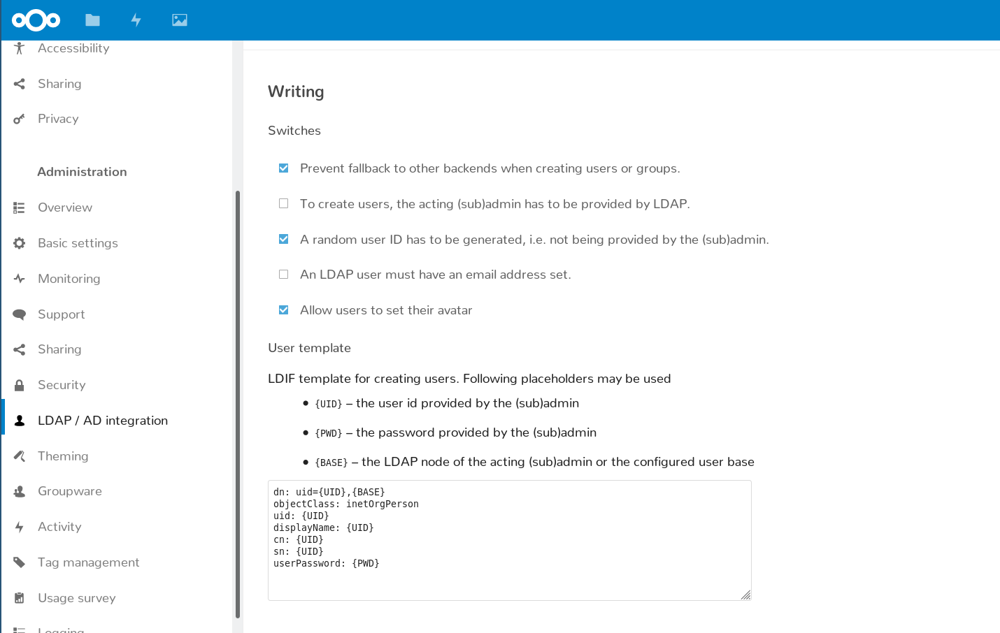

# 👥🖎 LDAP Write Support

Manage your LDAP directory from within Nextcloud.



* 📇 **Create records:** add new users and groups
* 📛 **Update details:** display name, email address and avatars
* ⚙️ **Integrated**: works in the known Nextcloud users page
* 📜 **Templates** configure an LDAP user template LDIF once

## Installation

This app requires the LDAP backend being enabled and configured, since it is a plugin to it. Find it on the app store!

For Nextcloud 16.0.1 and also to use all features in Nextcloud 16, a patch has to be applied accordingly (please replace the path):

```
cd /path/to/nextcloud
wget https://raw.githubusercontent.com/nextcloud/ldap_write_support/master/utilities/ldap_write_support-v16.0.1.patch
git apply -p1 < /path/to/ldap_write_support-v16.0.1.patch
```

`git` is required for applying the patch, because it contains changes in binary files (compiled javascript resources) and the good old `patch`  does not have support for it.

## Beware of the dog

* Due to the internal workings of Nextcloud in provisioning users and groups, the user has to meet the LDAP filter criteria upon creation. At this point of time only the username and password are known.
* When creating groups, and empty record of `groupOfNames` is created.

## 🏗 Development setup

1. ☁ Clone this app into the `apps` folder of your Nextcloud: `git clone https://github.com/nextcloud/ldap_write_support.git`
2. 👩‍💻 In the folder of the app, run the command `npm i` to install dependencies and `npm run build` to build the Javascript
3. ✅ Enable the app through the app management of your Nextcloud
4. 🎉 Partytime! Help fix [some issues](https://github.com/nextcloud/ldap_write_support/issues) and [review pull requests](https://github.com/nextcloud/ldap_write_support/pulls) 👍
